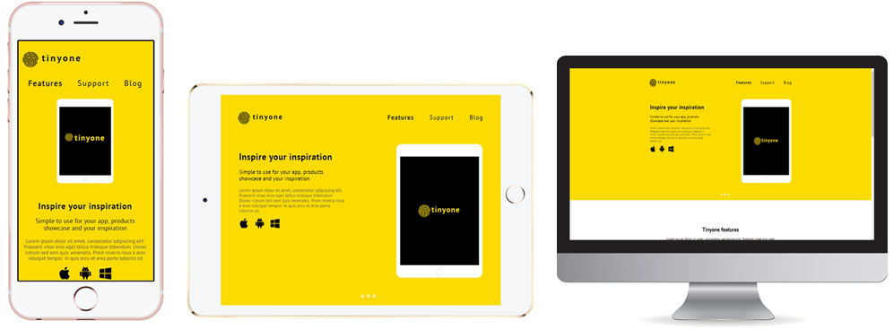

# Tinyone

Tinyone is a crisp and clean, subtle and slick, adaptive one page website (based on free psd website template). It is specifically constructed to meet the demands of the creative professionals having broad interests. [Demo](https://maksymchak.github.io/tinyone/)

# Built on:

* Bootstrap
* BEM methodology
* Animate.css
* Font Awesome Icons

# Features:

* HTML5 and CSS3
* Adaptive
* Clean and simple design
* Easy to customize & use

# Credits

### Bootstrap

[Bootstrap](http://getbootstrap.com/) by Twitter. Licensed under [MIT](https://github.com/twbs/bootstrap/blob/master/LICENSE)

### BEM

[BEM](https://en.bem.info/) by Yandex.

### Animate.css

[Animate.css](https://daneden.github.io/animate.css/) by Dan Eden

### Font Awesome Icons

[Font Awesome](http://fortawesome.github.io/Font-Awesome/) by Dave Gandy. Licensed under [MIT](http://opensource.org/licenses/mit-license.html)

## Misc

Follow Me: [LinkedIn](https://www.linkedin.com/in/anton-maksymchak/), [Facebook](https://www.facebook.com/Anton.Maksymchak), [GitHub](https://github.com/maksymchak)

©[Anton Maksymchak](https://github.com/maksymchak) 2018
